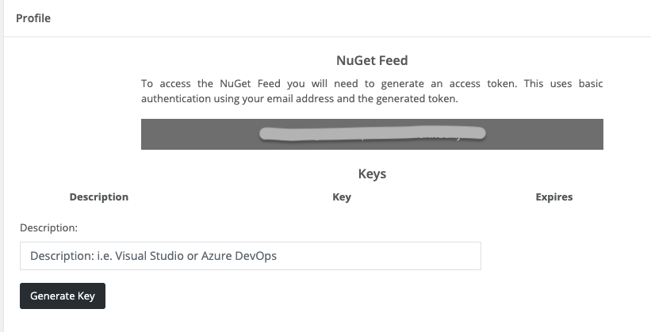
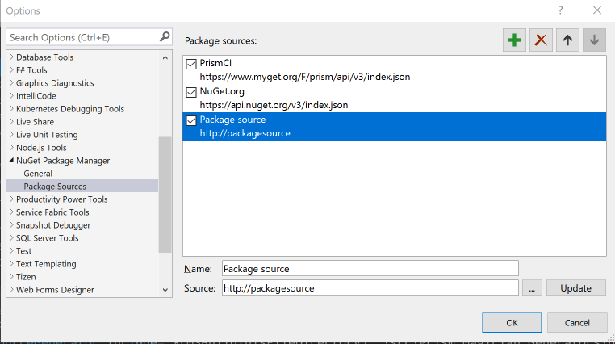

# Connecting to the Feed

Ok you're sold you want to use the Prism Magician... now what? This depends a little bit on whether you're a GitHub Sponsor or an Enterprise Support customer.

## GitHub Sponsors

Sign into the [Sponsor Connect](https://sponsorconnect.dev) portal. For this you will need to log in with your GitHub credentials. Note that the Sponsor Connect portal will request access to your private repos as it will require this for some upcoming functionality where you will be able to create projects and have them deployed to GitHub automatically.

## Enterprise Customers

For Enterprise Customers you can access the Prism.Magician through the AvantiPoint NuGet feed. Note that access to the AvantiPoint customer portal requires a Microsoft Account. While it is avisable that you have an Azure Active Directory tenant backing your login such as Office 365, we can work with you to grant access on a case by case basis.

## Connecting to the NuGet Feed

Once logged into the portal, you will see the connection information along with an area to create a key. Keys will remain valid for one year at which time you will need to generate a new key.



Once you generate a key you will need to head over to Visual Studio and add the feed as a source.

!!! note
    Both feeds require a username and password. For those connecting to Sponsor Connect you will use your GitHub username. For those connecting to the AvantiPoint Enterprise NuGet feed, you will use your full Microsoft work or personal email address that you used to login.

### Setting up the Feed in Visual Studio

To add a package source in Visual Studio, you can click on:

- Tools -> Options
- Tools -> NuGet Package Manager -> Package Manager Settings

Both will open the Options dialog, while the second one will bring you to the NuGet Package Manager group. Once there select the second option for the Package Sources:



Click the Plus Icon in the upper right corner and you will get a new `Package source` that you can edit. Give it a name and add the source url from either the Sponsor Connect or AvantiPoint Portal. Click Update and then click Ok.

Next open a project and select the new Package Feed as the source. It should prompt you for your username and a password which will be the token you created in the portal.

!!! tip
    Visual Studio will add the Package Source credentials to the Windows Credential Manager. In the event that you need to update the token, open the Credential Manager, select Windows Credentials and then delete any entries for the nuget feed. You may see multiple entries including the feed domain in both the Windows Credentials and Generic Credentials, along with a VSCredentials_domainname

### Setting up the Feed in Visual Studio for Mac

For Visual Studio Mac, click on the Visual Studio application name in the upper left of the toolbar and select Preferences from the dropdown menu.


Scroll to the bottom and you will find the NuGet Sources. Click Add and the Add Package Source dialog will appear. Give it a name and the url from the portal. Now add your username in the username field and the token you created in the portal in the password field and click Add Source.

!!! tip
    You can come back to the Sources any time to update the password

## Troubleshooting

Some users have reported issues connecting to the package feed. In the event that you are unable to resolve the connection issues, it recommended that you configure the package source from the CLI.

```powershell
nuget sources Add -Name "SponsorConnect" -Source "https://sponsorconnect.dev/v3/index.json" -Username "githubUsernameHere" -Password "sponsorConnectApiKeyHere" -ValidAuthenticationTypes basic
```

!!! tip
    The NuGet CLI is already part of the path as part of the Mono installation for Mac users. Windows users who have not made the NuGet CLI accessible in the path on their developer machine can download the latest version [here](https://dist.nuget.org/win-x86-commandline/latest/nuget.exe).
